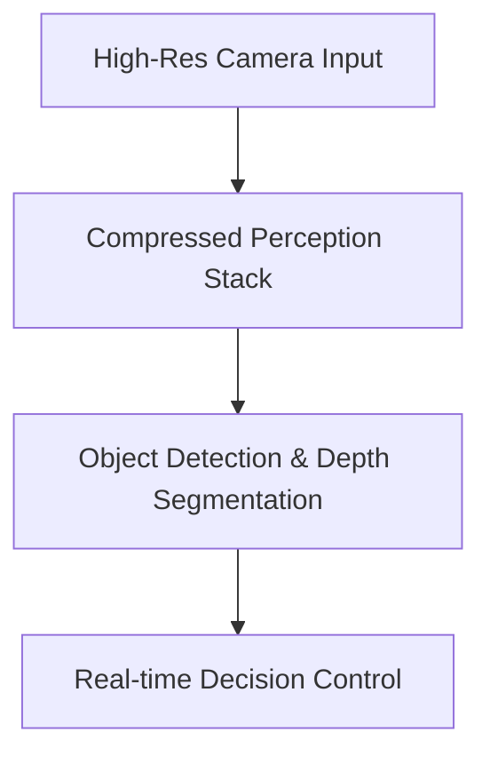

# Autonomous Vehicle Microcontroller Compression

[← Back to README](../README.md)

Self-driving perception stacks must process high-resolution video streams in real-time under tight power and thermal constraints.

## Application

Structured filter and channel pruning compress deep convolutional perception backbones to fit within the small VRAM of embedded hardware (like NVIDIA Jetson or custom microcontrollers).

### Process Flow

## Advantages & Limitations

*   **Pros:** Enables millisecond-level reaction times and reduces power consumption.
*   **Cons:** Requires careful validation to ensure safety-critical detections are not pruned.
