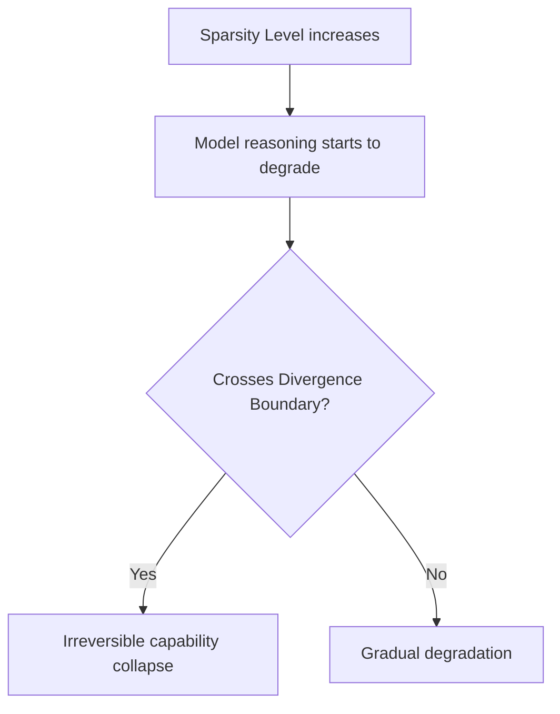

# The Capacity-Starved Divergence Boundary

[← Back to README](../README.md)

When models are pruned past a critical threshold, their capabilities degrade sharply and irreversibly.

## The Challenge

For compact models (e.g., <7B LLMs), pruning more than 50-60% of weights causes a total capability collapse, where complex reasoning (math, code, logic) fails entirely.

### Process Flow

## Mitigations

*   **Layer-wise Sensitivity Analysis:** Keep critical layers (like early projections and key attention heads) dense while heavily pruning redundant layers.
*   **Knowledge Distillation:** Train the pruned model using the original dense model as a teacher.
