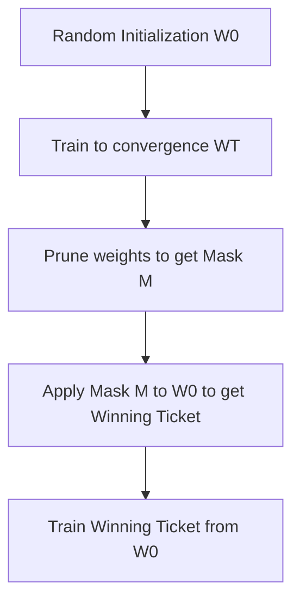

# The Lottery Ticket Hypothesis

[← Back to README](../README.md)

Proposed by Jonathan Frankle and Michael Carbin in 2018, this hypothesis states that a randomly-initialized, dense neural network contains a sub-network ('winning ticket') that can be trained in isolation to match the test accuracy of the original network.

## How It Works

The sub-network is identified by training a dense network, pruning it to get a sparse mask, and then resetting the remaining weights to their original values at initialization.

### Process Flow

## Advantages & Limitations

*   **Pros:** Proves that sparse models can be trained from scratch if initialized correctly.
*   **Cons:** Finding the winning ticket requires training the full dense network first, which is computationally expensive.
