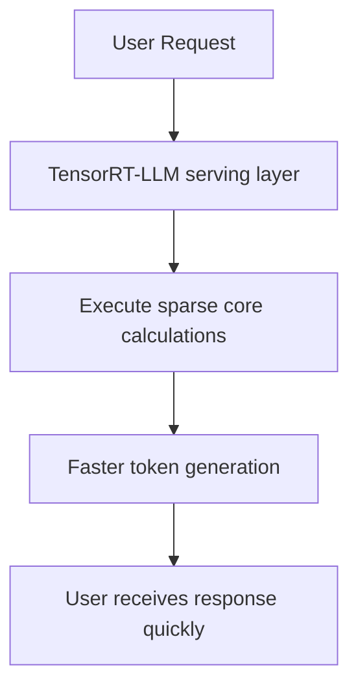

# Low-Latency Enterprise LLM Inference Serving

[← Back to README](../README.md)

Enterprise cloud deployments use pruning to accelerate inference speed and serve more users concurrently.

## Application

Using semi-structured 2:4 sparsity, systems like NVIDIA TensorRT-LLM double token generation throughput, reducing Time-to-First-Token (TTFT) and serving costs.

### Process Flow

## Key Technologies

*   **NVIDIA TensorRT-LLM:** Deep integration with Ampere/Hopper sparse Tensor Cores.
*   **Dynamic Batching:** Combines multiple sparse requests to maximize hardware utilization.
