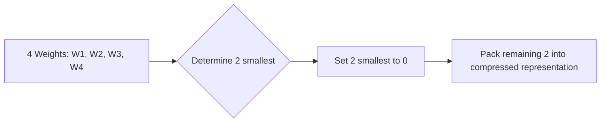

# N:M Sparsity Standard

[← Back to README](../README.md)

N:M sparsity is a structured-sparse format where every block of $M$ parameters contains exactly $N$ non-zero parameters.

## How It Works

Modern GPUs (like NVIDIA's Ampere/Hopper architecture) support 2:4 structured sparsity natively. The sparse tensor core compresses the matrix to half its size and performs computation in half the time.

### Process Flow

## Advantages & Limitations

*   **Pros:** Immediate $2\times$ latency improvement.
*   **Cons:** Strict N:M template constraint can limit maximum compression ratio.
