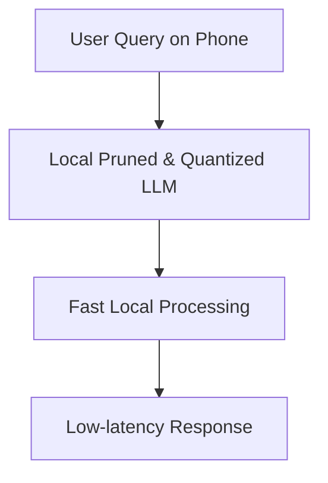

# On-Device Personalization for Consumer Electronics

[← Back to README](../README.md)

Running localized assistants (Mobile LLMs) on smartphones or laptops requires reducing their memory footprints.

## Application

Weight pruning combined with 4-bit quantization (BitsAndBytes) allows models to fit into standard mobile RAM, running locally without needing cloud API calls.

### Process Flow

## Key Benefits

*   **Privacy:** Data never leaves the device.
*   **Offline Mode:** Works without internet access.
*   **Energy Efficiency:** Reduces processor load and saves battery.
