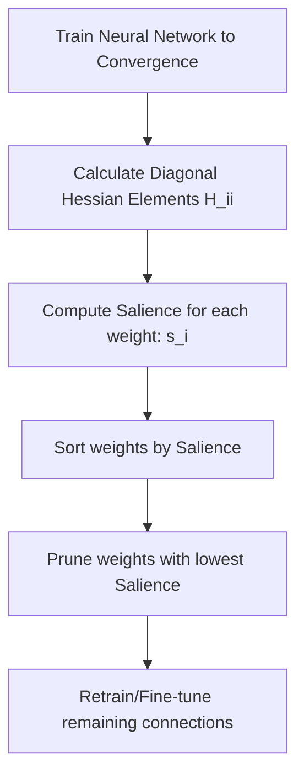

# Optimal Brain Damage (OBD)

[← Back to README](../README.md)

Optimal Brain Damage (OBD) is an analytical, second-order derivative pruning technique introduced by Yann LeCun, John S. Denker, and Sara A. Solla in 1989. It aims to reduce the size of a neural network by removing weights that have the least impact on the training error.

## How It Works

OBD approximates the change in the objective function ($E$) caused by perturbing the weights ($w$). By using a second-order Taylor expansion and assuming that the network has converged (so first-order derivatives are near zero) and that the Hessian matrix is diagonal (neglecting cross-terms), the "salience" ($s_i$) of each weight $w_i$ is computed as:

$$s_i = \frac{1}{2} H_{ii} w_i^2$$

where $H_{ii}$ is the diagonal element of the Hessian matrix.

### Process Flow

## Advantages & Limitations

*   **Pros:** Highly analytical; removes weights based on their true contribution to the loss function rather than simple magnitudes.
*   **Cons:** Extremely computationally expensive. Calculating the Hessian or even its diagonal elements becomes intractable for modern neural networks with millions or billions of parameters.
