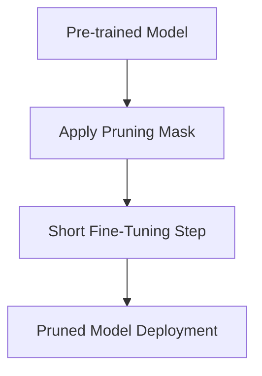

# Post-Training Pruning (PTP)

[← Back to README](../README.md)

Post-Training Pruning (PTP) refers to pruning a model after it has reached full convergence, without retraining it from scratch.

## How It Works

PTP starts with a fully trained model, applies pruning (e.g. magnitude, second-order, or activation-aware), and optionally performs short fine-tuning to recover lost accuracy.

### Process Flow

## Advantages & Limitations

*   **Pros:** Resource-efficient; avoids expensive full-training loops.
*   **Cons:** May fail to recover performance on highly compressed models.
