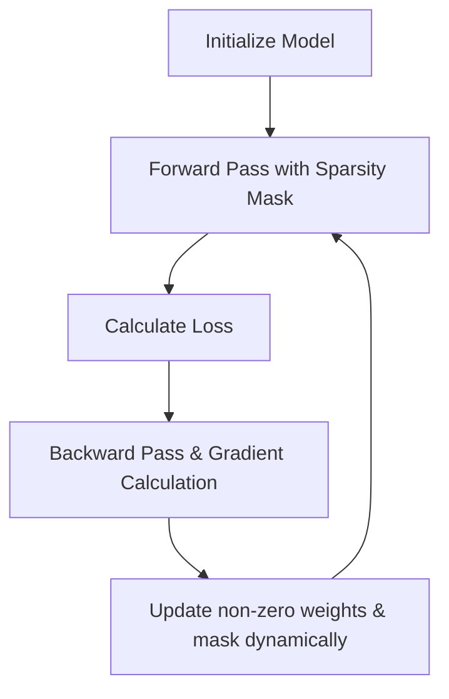

# Pruning-Aware Training (PAT)

[← Back to README](../README.md)

Pruning-Aware Training (PAT), also known as sparse training, integrates pruning constraints directly into the network training process.

## How It Works

PAT masks weights to zero during training, updating only non-masked weights during backpropagation, or dynamically adjusting the mask based on gradients.

### Process Flow

## Advantages & Limitations

*   **Pros:** Achieves higher accuracy at extreme sparsity levels.
*   **Cons:** Training is computationally expensive and takes longer.
