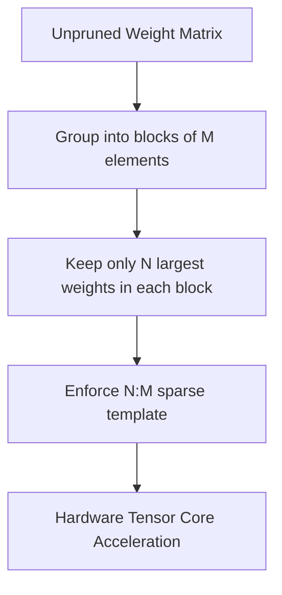

# Semi-Structured Pruning (N:M Sparsity)

[← Back to README](../README.md)

Semi-structured pruning (specifically N:M sparsity) bridges the gap between unstructured sparsity (which has high accuracy but poor hardware acceleration) and structured sparsity (which has good hardware acceleration but lower accuracy). It was popularized by NVIDIA with the Ampere architecture (2:4 sparsity).

## How It Works

In a 2:4 sparsity pattern, out of every 4 contiguous elements in a matrix, exactly 2 must be zero. This pattern is enforced during training or post-training, and modern Tensor Cores can skip the zero values to double math throughput.

### Pattern Visualization

```mermaid
grid-layout
[ 1.2, 0.0, -0.4, 0.0 ] -> 2 of 4 are zero
```



## Advantages & Limitations

*   **Pros:** Provides a guaranteed $2\times$ mathematical speedup on compatible hardware (NVIDIA Ampere/Hopper).
*   **Cons:** Hardware-dependent; does not accelerate on older or non-NVIDIA GPUs without specific compiler support.
