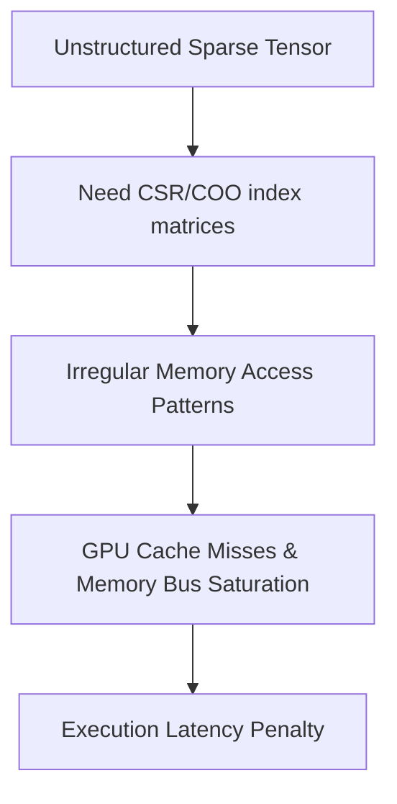

# The Sparse Memory-Access Latency Penalty

[← Back to README](../README.md)

While unstructured pruning reduces FLOPs, storing and loading sparse matrices introduces significant memory overhead due to index tracking.

## The Challenge

Sparse matrices require auxiliary index arrays (e.g., Compressed Sparse Row - CSR format) to store non-zero locations. Random memory lookups saturate GPU memory buses, making unstructured sparse networks slower than dense networks in practice.

### Process Flow

## Solutions

*   **Semi-structured N:M sparsity:** Avoids auxiliary indexing arrays by enforcing a regular template.
*   **Structured Pruning:** Reduces the tensor dimensions directly, maintaining dense matrix properties.
