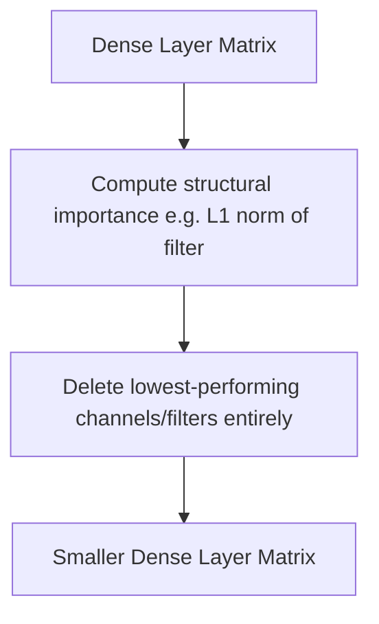

# Structured Pruning (Channel & Filter Deletion)

[← Back to README](../README.md)

Structured pruning removes entire architectural structures, such as convolutional filters, attention channels, or entire layers.

## How It Works

Instead of setting individual weights to zero, structured pruning deletes entire columns or rows from the weight matrices, resulting in smaller dense matrices.

### Process Flow

## Advantages & Limitations

*   **Pros:** Natively compatible with off-the-shelf hardware (GPUs/CPUs) without requiring special compilers or libraries.
*   **Cons:** Can lead to higher accuracy drops at high compression rates compared to unstructured pruning.
