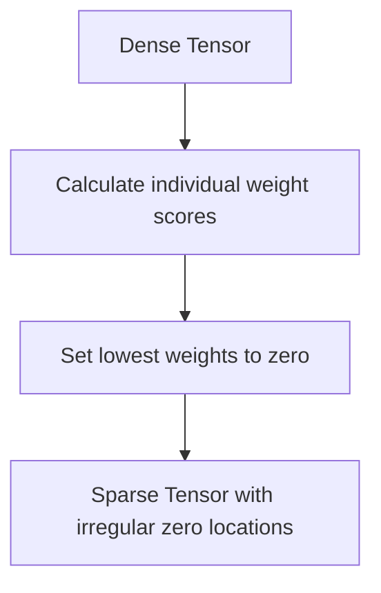

# Unstructured Pruning (Element-Wise Deletion)

[← Back to README](../README.md)

Unstructured pruning deletes individual weights anywhere in the network based on a metric (like magnitude or salience), without respecting any structural blocks.

## How It Works

Weights are treated individually. A mask is applied to the weight tensor, setting pruned coordinates to zero.

### Process Flow

## Advantages & Limitations

*   **Pros:** High compression ratios (often 90%+) with very low accuracy loss.
*   **Cons:** Irregular memory access patterns make standard GPUs process them slowly.
